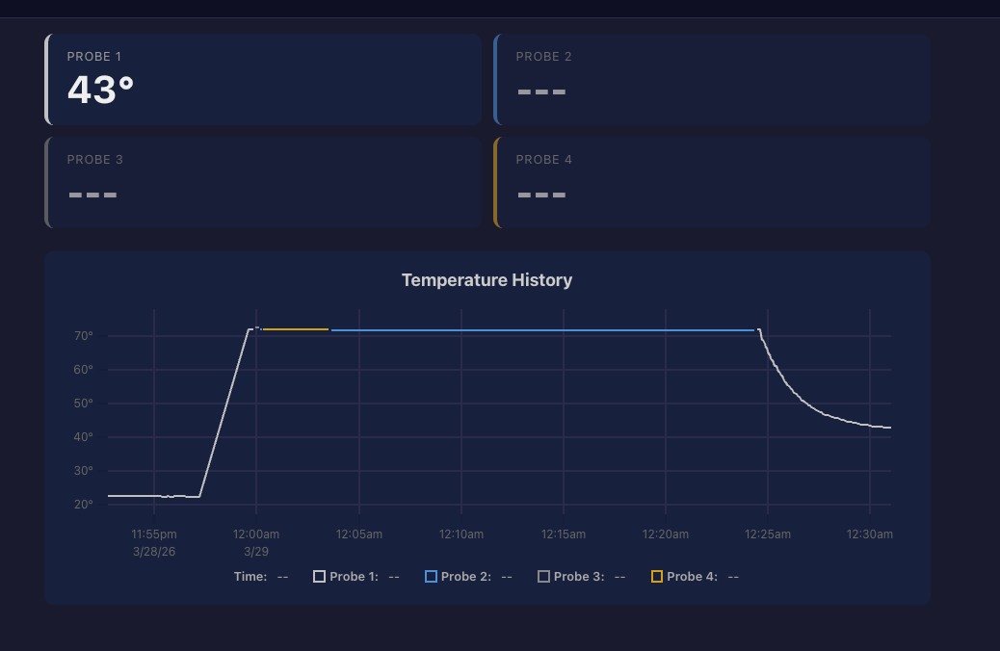

# Therm-Pro

Remote BBQ temperature monitoring system for the ThermPro TP25. An ESP32 connects to the TP25 over Bluetooth LE and relays temperature data over WiFi to a Go server, which provides a real-time web dashboard and Slack alerts.

```
TP25 --BLE--> ESP32 --HTTP/WiFi--> Go Server --WebSocket--> Browser
                                       |
                                       +--Webhook--> Slack
```



## Features

- **4 probe support** -- pit temp + 3 meat probes, all tracked independently
- **Real-time web dashboard** -- mobile-friendly with dark/light theme toggle, per-probe color coding (silver, blue, black, gold), live-updating probe cards and time-series chart
- **Slack alerts** -- notifications when target temps are hit or pit temp drifts out of range
- **Alert hysteresis** -- alerts fire once, reset after 3 degrees F, rate-limited to avoid spam
- **OTA firmware updates** -- upload new ESP32 firmware via the server, ESP32 pulls it on boot
- **Session persistence** -- cook data survives server restarts, manual reset between cooks
- **Consul service discovery** -- server auto-registers with local Consul agent; ESP32 finds the server via DNS (`tp25.service.consul`)
- **Graceful shutdown** -- server deregisters from Consul and drains connections on SIGINT/SIGTERM

## Prerequisites

- **[Flox](https://flox.dev)** -- manages all development dependencies (Go, PlatformIO, GNU Make)
- **ESP32 dev board** -- any ESP32 with WiFi and BLE (e.g., ESP32-DevKitC)
- **ThermPro TP25** -- the Bluetooth BBQ thermometer

## Setting Up the Development Environment

This project uses [Flox](https://flox.dev) for dependency management. Flox provides Go, PlatformIO, and GNU Make in an isolated environment.

```bash
# Install Flox if you don't have it (https://flox.dev/docs/install)
# macOS:
brew install flox

# Clone the repo
git clone https://github.com/stahnma/therm-pro.git
cd therm-pro

# Activate the Flox environment (installs Go, PlatformIO, espflash, GNU Make)
flox activate
```

Once inside the Flox environment, all tools are available. You can verify with:

```bash
go version         # Go compiler
pio --version      # PlatformIO (build)
espflash --version # ESP32 flasher
make --version     # GNU Make
```

## Quick Start

### 1. Build and Run the Server

```bash
# Inside flox activate shell:

# Build the server binary
make build

# Run (listens on port 8088 by default)
./bin/therm-pro-server
```

The server stores session data in `~/.therm-pro/session.json`.

**Configuration via environment variables:**

| Variable | Default | Description |
|----------|---------|-------------|
| `PORT` | `8088` | HTTP server port |
| `THERM_PRO_SLACK_WEBHOOK` | _(empty)_ | Slack incoming webhook URL for alerts |

The server automatically registers itself as service `tp25` with the local Consul agent (`localhost:8500`) on startup, using the auto-detected LAN IP. If Consul isn't running, the server logs a warning and operates normally.

Example with Slack:

```bash
THERM_PRO_SLACK_WEBHOOK="https://hooks.slack.com/services/T.../B.../..." ./bin/therm-pro-server
```

### 2. Configure and Flash the ESP32

Configuration is driven by environment variables so that secrets are never committed to git. Set these before building:

```bash
export ESP32_WIFI_SSID="your-wifi-name"
export ESP32_WIFI_PASS="your-wifi-password"

# Optional (these have defaults):
# export ESP32_SERVER_URL="http://tp25.service.consul:8088"  # default; override if not using Consul DNS
# export ESP32_FIRMWARE_VERSION=1
# export ESP32_LED_PIN=2
```

If you have Consul DNS forwarding set up (port 53), the default `SERVER_URL` of `http://tp25.service.consul:8088` will resolve automatically. Otherwise, set `ESP32_SERVER_URL` to the server's LAN IP.

Build and flash (inside the flox environment):

```bash
# Generate config.h, build, and flash in one step (connect ESP32 first)
make esp32-flash

# Or step by step:
make esp32-config    # Generate config.h from env vars
make esp32-build     # Compile firmware
make esp32-flash     # Build + flash via USB

# Monitor serial output (useful for verifying WiFi/BLE connection)
make esp32-monitor
```

The generated `esp32/src/config.h` is gitignored. A reference template is available at `esp32/src/config.h.example`.

Flashing uses [espflash](https://github.com/esp-rs/espflash) (a Rust-based flasher provided by flox) instead of PlatformIO's esptool, which avoids pyserial compatibility issues under nix.

### 3. Open the Dashboard

Open `http://<server-ip>:8088` in a browser. You should see 4 probe cards updating in real time once the ESP32 connects to the TP25.

## Usage

### Setting Up a Cook

1. Turn on your TP25 and insert probes
2. Power on the ESP32 -- it will auto-connect to the TP25 (LED blinks while scanning, solid when connected)
3. Open the dashboard on your phone or laptop
4. Tap each probe card to set a label (e.g., "Pit", "Brisket") and alert thresholds
5. Cook!

### Alert Types

| Alert | Use Case | Example |
|-------|----------|---------|
| **Target temp** | Meat is done | Brisket probe hits 203 F |
| **High temp** | Pit running hot | Pit temp exceeds 275 F |
| **Low temp** | Pit running cold / fire dying | Pit temp drops below 225 F |

Alerts fire once when the threshold is crossed, then reset after the temperature moves 3 degrees F past the threshold (hysteresis). Minimum 60 seconds between repeated alerts for the same probe.

### Resetting Between Cooks

Click the "Reset Cook" button on the dashboard (or `POST /api/session/reset`) to clear all temperature history. Probe labels and alert configurations are preserved.

## API

All endpoints are available at `http://<server-ip>:8088`.

| Method | Endpoint | Description |
|--------|----------|-------------|
| `GET` | `/` | Web dashboard |
| `GET` | `/healthz` | Health check (liveness probe for Consul) |
| `GET` | `/diagnostics` | System diagnostics and connectivity status |
| `POST` | `/api/data` | Submit probe readings (ESP32 uses this) |
| `GET` | `/api/session` | Get current cook session |
| `POST` | `/api/session/reset` | Reset cook session |
| `POST` | `/api/alerts` | Set alert config for a probe |
| `GET` | `/api/ws` | WebSocket for live updates |
| `GET` | `/api/firmware/latest` | Check latest firmware version |
| `GET` | `/api/firmware/download` | Download firmware binary |
| `POST` | `/api/firmware/upload` | Upload new firmware binary |

### Example: Submit Temperature Data

```bash
curl -X POST http://localhost:8088/api/data \
  -H 'Content-Type: application/json' \
  -d '{
    "probes": [
      {"id": 1, "temp_f": 250.0},
      {"id": 2, "temp_f": 165.3},
      {"id": 3, "temp_f": 180.1},
      {"id": 4, "temp_f": -999.0}
    ],
    "battery": 85,
    "firmware_version": 2,
    "ble_connected": true
  }'
```

A `temp_f` of `-999.0` indicates a disconnected probe. The `firmware_version` and `ble_connected` fields are optional and used by the `/diagnostics` endpoint to report ESP32 status.

### Example: Set Alert

```bash
# Target temperature alert (meat probe)
curl -X POST http://localhost:8088/api/alerts \
  -H 'Content-Type: application/json' \
  -d '{"probe_id": 2, "alert": {"target_temp": 203.0}}'
```

```bash
# Range alert (pit probe)
curl -X POST http://localhost:8088/api/alerts \
  -H 'Content-Type: application/json' \
  -d '{"probe_id": 1, "alert": {"low_temp": 225.0, "high_temp": 275.0}}'
```

## OTA Firmware Updates

After the initial USB flash, you can update the ESP32 over WiFi:

1. Make your code changes in `esp32/src/`
2. Increment the firmware version and rebuild:

```bash
export ESP32_FIRMWARE_VERSION=2   # bump from previous version
make esp32-build
```

4. Upload the binary to the server:

```bash
curl -X POST http://localhost:8088/api/firmware/upload \
  -F "firmware=@esp32/.pio/build/esp32/firmware.bin" \
  -F "version=2"
```

5. Reboot the ESP32 (power cycle or reset button) -- it checks for updates on boot and will self-flash

## ESP32 LED Status

| LED State | Meaning |
|-----------|---------|
| Blinking | Connecting to WiFi or scanning for TP25 |
| Solid on | Connected to TP25 and sending data |
| Off | BLE disconnected, attempting reconnect |

## Network Setup

The server runs on your local network. The ESP32 and your phone/laptop need to be on the same network (or have routes to the server).

**Accessing from outside your network:** Set up port forwarding on your router to forward an external port to `<server-ip>:8088`. The specifics depend on your router.

## Project Structure

```
therm-pro/
  .flox/                         Flox environment (Go, PlatformIO, Make)
  cmd/therm-pro-server/          Go server entry point
  internal/
    api/                         HTTP handlers, WebSocket, routes
    consul/                      Consul service registration
    cook/                        Session data model, alerts, persistence
    firmware/                    OTA firmware management
    slack/                       Slack webhook client
    web/static/                  Embedded dashboard (HTML/CSS/JS)
  esp32/
    src/                         ESP32 firmware (Arduino/C++)
    platformio.ini               PlatformIO build config
  docs/plans/                    Design and implementation docs
```

## Running Tests

```bash
# Inside flox activate shell:
go test ./...
```

## Development

### Building Without Flox

If you prefer not to use Flox, install the dependencies manually:

- [Go 1.21+](https://go.dev/dl/)
- [PlatformIO Core](https://docs.platformio.org/en/latest/core/installation.html)
- GNU Make

Then use the same `make build`, `pio run`, etc. commands.

### Simulating the ESP32

You can develop and test the server without an ESP32 by simulating probe data with curl:

```bash
# Start the server
make run

# In another terminal, simulate temperature readings
while true; do
  curl -s -X POST http://localhost:8088/api/data \
    -H 'Content-Type: application/json' \
    -d "{\"probes\":[
      {\"id\":1,\"temp_f\":$(shuf -i 240-260 -n 1)},
      {\"id\":2,\"temp_f\":$(shuf -i 160-205 -n 1)},
      {\"id\":3,\"temp_f\":$(shuf -i 170-195 -n 1)},
      {\"id\":4,\"temp_f\":-999}
    ],\"battery\":85}"
  sleep 3
done
```

### Cross-Compiling the Server

The Go server can be cross-compiled for Linux (e.g., to run on a Raspberry Pi):

```bash
GOOS=linux GOARCH=arm64 make build    # ARM64 (Raspberry Pi 4, etc.)
GOOS=linux GOARCH=amd64 make build    # x86_64
```

Copy `bin/therm-pro-server` to the target machine and run it.

## Slack Webhook Setup

1. Go to [Slack API: Incoming Webhooks](https://api.slack.com/messaging/webhooks)
2. Create a new app (or use an existing one)
3. Enable Incoming Webhooks
4. Add a new webhook to a channel of your choice
5. Copy the webhook URL and set it as `THERM_PRO_SLACK_WEBHOOK`

Alert messages include the alert details and current temps for all 4 probes.

## Diagnostics

The `/diagnostics` endpoint provides a full connectivity health check across the system. Access it from the "Diagnostics" link in the dashboard nav bar or via curl:

```bash
curl -s http://localhost:8088/diagnostics | jq .
```

Example response:

```json
{
  "status": "ok",
  "server_firmware_version": 3,
  "consul": {
    "registered": true,
    "service_id": "tp25-myhost",
    "service_url": "http://192.168.1.100:8088",
    "health_url": "http://192.168.1.100:8088/healthz",
    "healthy": true
  },
  "esp32": {
    "status": "ok",
    "ip": "192.168.1.50:54321",
    "firmware_version": 3,
    "ble_connected": true,
    "last_seen": "2025-07-04T14:30:00Z",
    "data_age": "3s",
    "data_age_seconds": 3
  }
}
```

The top-level `status` is `"ok"` when everything is healthy, or `"degraded"` when any component has an issue. Here's what to look for:

| Problem | What you'll see |
|---------|-----------------|
| Consul not running or registration failed | `consul.healthy: false` with an error message |
| ESP32 has never connected | `esp32.status: "no data received"` |
| ESP32 stopped sending data (>30s) | `esp32.status: "stale"` with `data_age` showing how long |
| ESP32 can't find the TP25 | `esp32.ble_connected: false`, `esp32.status: "ble_disconnected"` |
| Firmware version mismatch | Compare `server_firmware_version` vs `esp32.firmware_version` |

## Troubleshooting

### ESP32 won't connect to TP25
- Make sure the TP25 is powered on and not connected to another device (phone app, etc.)
- The TP25 advertises as "Thermopro" -- check serial monitor output for scan results
- Try power cycling both the TP25 and ESP32

### ESP32 can't reach the server
- Verify WiFi credentials in `config.h`
- If using Consul DNS, verify `tp25.service.consul` resolves: `dig tp25.service.consul`
- If not using Consul, check that `ESP32_SERVER_URL` matches the server's LAN IP
- Ensure the ESP32 and server are on the same network
- Check serial monitor for connection errors

### PlatformIO build fails under Flox
- If the ESP32 toolchain fails to install, try `pio pkg install` separately first

### ESP32 flashing fails
- Make sure you're using `make esp32-flash` (uses espflash) rather than `pio run -t upload` (uses pyserial, which has issues under nix)
- If espflash can't find the port, try `espflash flash --port /dev/cu.usbserial-XXXXX esp32/.pio/build/esp32/firmware.elf`
- Run `espflash list-ports` to see available serial ports

### Dashboard not updating
- Check that the ESP32 is connected (solid LED)
- Open browser dev tools and check the WebSocket connection to `/api/ws`
- Verify data is arriving: `curl http://localhost:8088/api/session`

## License

MIT
