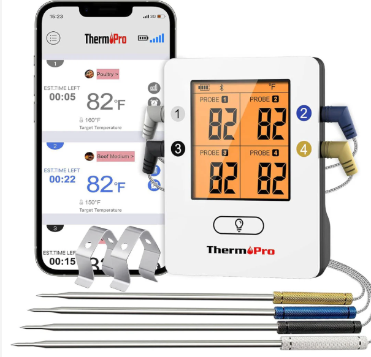

# Therm-Pro

Remote BBQ temperature monitoring system for the ThermPro TP25. An ESP32 connects to the TP25 over Bluetooth LE and relays temperature data over WiFi to a Go server, which provides a real-time web dashboard and Slack alerts.

```
TP25 --BLE--> ESP32 --HTTP/WiFi--> Go Server --WebSocket--> Browser
                                       |
                                       +--Webhook--> Slack
```


## The ThermoPro TP25

The [ThermoPro TP25](https://buythermopro.com/products/tp25-wireless-leave-in-meat-thermometer) ([Amazon](https://www.amazon.com/dp/B09MJ1H5JY)) is a wireless Bluetooth leave-in meat thermometer that supports up to 4 probes. It transmits temperature readings over Bluetooth Low Energy (BLE), which makes it possible to bypass the official phone app and read data directly with an ESP32.



## Features

- **4 probe support** -- pit temp + 3 meat probes, all tracked independently
- **Real-time web dashboard** -- mobile-friendly with dark/light theme toggle, Fahrenheit/Celsius toggle, per-probe color coding (silver, blue, black, gold), live-updating probe cards and time-series chart
- **Slack alerts** -- notifications when target temps are hit or pit temp drifts out of range
- **Alert hysteresis** -- alerts fire once, reset after 3 degrees F, rate-limited to avoid spam
- **OTA firmware updates** -- upload new ESP32 firmware via the server, ESP32 pulls it on boot
- **Session persistence** -- cook data survives server restarts, manual reset between cooks
- **Consul service discovery** -- server auto-registers with local Consul agent; ESP32 finds the server via DNS (`tp25.service.dc1.consul`)
- **Graceful shutdown** -- server deregisters from Consul and drains connections on SIGINT/SIGTERM

## What You Need

- **ESP32 dev board** -- any ESP32 with WiFi and BLE (e.g., ESP32-DevKitC)
- **ThermPro TP25** -- the Bluetooth BBQ thermometer
- **A machine to run the server** -- Linux, macOS, or anything that runs Go binaries (a Raspberry Pi works great)

## Quick Start

### 1. Build the Server

You'll need [Go 1.21+](https://go.dev/dl/) and GNU Make. If you use [Flox](https://flox.dev), `flox activate` provides all dependencies automatically.

```bash
git clone https://github.com/stahnma/therm-pro.git
cd therm-pro
make build
```

Cross-compile for a different target (e.g., Raspberry Pi):

```bash
GOOS=linux GOARCH=arm64 make build    # ARM64 (Raspberry Pi 4, etc.)
GOOS=linux GOARCH=amd64 make build    # x86_64
```

### 2. Run the Server

```bash
./bin/therm-pro-server
```

The server listens on port 8088 by default and stores session data in `~/.therm-pro/session.json`.

**Configuration** is loaded in layers (each overrides the previous):

1. Built-in defaults
2. `~/.therm-pro/config.yaml` (optional)
3. `~/.therm-pro/.env` (optional)
4. Environment variables

| Variable | Default | Description |
|----------|---------|-------------|
| `PORT` | `8088` | HTTP server port |
| `THERM_PRO_REGISTRATION_PIN` | _(empty)_ | PIN required to register a new passkey (empty = registration disabled) |
| `THERM_PRO_WEBAUTHN_ORIGIN` | `http://localhost:8088` | WebAuthn origin URL (set to your public URL for passkey auth; domain is derived automatically) |
| `THERM_PRO_LOG_LEVEL` | `info` | Log verbosity: `debug`, `info`, `warn`, `error` |
| `THERM_PRO_SLACK_WEBHOOK` | _(empty)_ | Slack incoming webhook URL for alerts |
| `THERM_PRO_SLACK_SIGNING_SECRET` | _(empty)_ | Slack app signing secret (for `/tp25` slash command) |
| `THERM_PRO_SLACK_BOT_TOKEN` | _(empty)_ | Slack bot token (for `/tp25` slash command) |

Example `~/.therm-pro/config.yaml`:

```yaml
port: 8088
registration_pin: "1234"
webauthn_origin: "http://localhost:8088"
log_level: "info"

slack:
  webhook: ""
  signing_secret: ""
  bot_token: ""
```

**Access control:** Unauthenticated users see a read-only dashboard. Authenticate with a [passkey](#passkey-authentication) for full read/write access. See [Access Control](#access-control) below.

The server automatically registers itself with the local Consul agent (`localhost:8500`) on startup. If Consul isn't running, the server logs a warning and operates normally.

### 3. Flash the ESP32

Set your WiFi credentials and build/flash the firmware. You'll need [PlatformIO](https://docs.platformio.org/en/latest/core/installation.html) (or use `flox activate` which provides it).

```bash
export ESP32_WIFI_SSID="your-wifi-name"
export ESP32_WIFI_PASS="your-wifi-password"

# Optional: override if not using Consul DNS
# export ESP32_SERVER_URL="http://192.168.1.100:8088"

# Generate config, build, and flash in one step (connect ESP32 via USB first)
make esp32-flash
```

If you have Consul DNS forwarding set up, the default server URL of `http://tp25.service.dc1.consul:8088` resolves automatically. Otherwise, set `ESP32_SERVER_URL` to the server's LAN IP.

The generated `esp32/src/config.h` is gitignored. A reference template is at `esp32/src/config.h.example`.

### 4. Open the Dashboard

Open `http://<server-ip>:8088` in a browser. You should see 4 probe cards updating in real time once the ESP32 connects to the TP25.

## Using Therm-Pro

### Setting Up a Cook

1. Turn on your TP25 and insert probes
2. Power on the ESP32 -- it will auto-connect to the TP25 (LED blinks while scanning, solid when connected)
3. Open the dashboard on your phone or laptop
4. Tap each probe card to set a label (e.g., "Pit", "Brisket") and alert thresholds
5. Cook!

### Alert Types

| Alert | Use Case | Example |
|-------|----------|---------|
| **Target temp** | Meat is done | Brisket probe hits 203 F |
| **High temp** | Pit running hot | Pit temp exceeds 275 F |
| **Low temp** | Pit running cold / fire dying | Pit temp drops below 225 F |

Alerts fire once when the threshold is crossed, then reset after the temperature moves 3 degrees F past the threshold (hysteresis). Minimum 60 seconds between repeated alerts for the same probe.

### Resetting Between Cooks

Click the "Reset Cook" button on the dashboard to clear all temperature history. Probe labels and alert configurations are preserved.

### ESP32 LED Status

| LED State | Meaning |
|-----------|---------|
| Blinking | Connecting to WiFi or scanning for TP25 |
| Solid on | Connected to TP25 and sending data |
| Off | BLE disconnected, attempting reconnect |

### OTA Firmware Updates

After the initial USB flash, you can update the ESP32 over WiFi:

1. Make your code changes in `esp32/src/`
2. Bump the version and rebuild:
   ```bash
   export ESP32_FIRMWARE_VERSION=2
   make esp32-build
   ```
3. Upload to the server:
   ```bash
   make esp32-upload
   ```
4. Reboot the ESP32 (power cycle or reset button) -- it checks for updates on boot and will self-flash

### Slack Webhook Setup (Push Alerts)

1. Go to [Slack API: Incoming Webhooks](https://api.slack.com/messaging/webhooks)
2. Create a new app (or use an existing one)
3. Enable Incoming Webhooks
4. Add a new webhook to a channel of your choice
5. Copy the webhook URL and set it as `THERM_PRO_SLACK_WEBHOOK`

Alert messages include the alert details and current temps for all 4 probes.

### Slack `/tp25` Slash Command (Pull Status)

Type `/tp25` in any Slack channel to get the current cook status: probe temperatures, battery level, and a temperature history chart as a PNG image.

**Setup:**

1. Go to [api.slack.com/apps](https://api.slack.com/apps) and click **Create New App > From a manifest**
2. Select your workspace, then paste the contents of [`contrib/slack-app-manifest.json`](contrib/slack-app-manifest.json)
3. Replace `REPLACE_WITH_YOUR_DOMAIN` in the slash command URL with your actual domain
4. Install the app to your workspace
5. Set environment variables:
   - `THERM_PRO_SLACK_SIGNING_SECRET` -- from **Basic Information > App Credentials > Signing Secret**
   - `THERM_PRO_SLACK_BOT_TOKEN` -- from **OAuth & Permissions > Bot User OAuth Token** (starts with `xoxb-`)

**Network access:** Slack needs to reach your server over HTTPS. If the server is on a home network, use [Cloudflare Tunnel](https://developers.cloudflare.com/cloudflare-one/connections/connect-networks/) to expose the `/slack/command` endpoint without port forwarding:

```bash
# Install cloudflared and authenticate
cloudflared tunnel login
cloudflared tunnel create tp25

# Route traffic to your server
cloudflared tunnel route dns tp25 tp25.yourdomain.com

# Run the tunnel (or install as a systemd service)
cloudflared tunnel --url http://localhost:8088 run tp25
```

For development/testing, you can use [ngrok](https://ngrok.com/) instead: `ngrok http 8088`.

### Access Control

The dashboard has two access tiers:

| Tier | Who | Access |
|------|-----|--------|
| **Authenticated** | Users with a registered passkey | Full read/write via session cookie |
| **Unauthenticated** | Everyone else | Read-only — can view temps, chart, battery |

Protected actions (reset cook, set alerts, upload firmware) require a valid passkey session.

### Passkey Authentication

Passkeys let you authenticate using 1Password, Face ID, or any FIDO2 authenticator.

**Register a passkey:**

1. Set `registration_pin` in your config (or `THERM_PRO_REGISTRATION_PIN` env var)
2. Open the dashboard and click "Register Passkey" in the header
3. Enter the PIN when prompted
4. Follow the browser/authenticator prompt

Registration is disabled when no PIN is configured.

**Sign in:**

1. Open the dashboard from anywhere
2. Click "Sign In" in the header
3. Your authenticator (1Password, etc.) handles the rest
4. Session lasts 24 hours

**Production setup:** When running behind a reverse proxy (e.g., Cloudflare Tunnel), set `THERM_PRO_WEBAUTHN_ORIGIN` to your public URL (the domain is derived automatically):

```bash
THERM_PRO_WEBAUTHN_ORIGIN=https://tp25.yourdomain.com
```

### Network Setup

The server runs on your local network. The ESP32 and your phone/laptop need to be on the same network (or have routes to the server).

**Accessing from outside your network:** Set up port forwarding on your router to forward an external port to `<server-ip>:8088`. The specifics depend on your router.

## Installation

Build and install as a systemd service:

    make build
    sudo ./bin/therm-pro-server install

This will:
- Copy the binary to `/usr/local/bin/therm-pro-server`
- Create a `therm-pro` system user
- Create `/var/lib/therm-pro` data directory
- Install and enable a systemd unit

To install to a different prefix (e.g. `/usr` or `/opt`):

    sudo ./bin/therm-pro-server install --prefix=/usr

Start the service:

    sudo systemctl start therm-pro-server

Preview without making changes:

    ./bin/therm-pro-server install --dry-run

## Running as a systemd Service (Manual)

A systemd unit file is provided in `contrib/therm-pro-server.service`. To install manually:

```bash
# Create a dedicated user
sudo useradd -r -s /sbin/nologin -d /var/lib/therm-pro therm-pro

# Copy the binary
sudo cp bin/therm-pro-server /usr/local/bin/

# Install the unit file
sudo cp contrib/therm-pro-server.service /etc/systemd/system/

# (Optional) Set the Slack webhook
sudo systemctl edit therm-pro-server
# Add:
#   [Service]
#   Environment=THERM_PRO_SLACK_WEBHOOK=https://hooks.slack.com/services/T.../B.../...

# Enable and start
sudo systemctl daemon-reload
sudo systemctl enable --now therm-pro-server

# Check status
sudo systemctl status therm-pro-server
journalctl -u therm-pro-server -f
```

<details>
<summary>Diagnostics</summary>

The `/diagnostics` endpoint provides a full connectivity health check across the system. Access it from the "Diagnostics" link in the dashboard nav bar or via curl:

```bash
curl -s http://localhost:8088/diagnostics | jq .
```

Example response:

```json
{
  "status": "ok",
  "server_firmware_version": 3,
  "consul": {
    "registered": true,
    "service_id": "tp25-myhost",
    "service_url": "http://192.168.1.100:8088",
    "health_url": "http://192.168.1.100:8088/healthz",
    "healthy": true
  },
  "esp32": {
    "status": "ok",
    "ip": "192.168.1.50:54321",
    "firmware_version": 3,
    "ble_connected": true,
    "last_seen": "2025-07-04T14:30:00Z",
    "data_age": "3s",
    "data_age_seconds": 3
  }
}
```

The top-level `status` is `"ok"` when everything is healthy, or `"degraded"` when any component has an issue.

| Problem | What you'll see |
|---------|-----------------|
| Consul not running or registration failed | `consul.healthy: false` with an error message |
| ESP32 has never connected | `esp32.status: "no data received"` |
| ESP32 stopped sending data (>30s) | `esp32.status: "stale"` with `data_age` showing how long |
| ESP32 can't find the TP25 | `esp32.ble_connected: false`, `esp32.status: "ble_disconnected"` |
| Firmware version mismatch | Compare `server_firmware_version` vs `esp32.firmware_version` |

</details>

<details>
<summary>Logging</summary>

The server uses structured logging (`log/slog`) written to stderr. Set `THERM_PRO_LOG_LEVEL` to control verbosity:

```bash
# Debug logging — shows HTTP requests, session validation, network checks
THERM_PRO_LOG_LEVEL=debug ./bin/therm-pro-server

# Default — server lifecycle, auth events, alerts
THERM_PRO_LOG_LEVEL=info ./bin/therm-pro-server

# Quiet — only warnings and errors
THERM_PRO_LOG_LEVEL=warn ./bin/therm-pro-server
```

Debug mode is especially useful for diagnosing WebAuthn passkey failures through Cloudflare tunnels — it logs each step of the login/registration ceremony with remote address and error details.

</details>

<details>
<summary>Troubleshooting</summary>

#### ESP32 won't connect to TP25
- Make sure the TP25 is powered on and not connected to another device (phone app, etc.)
- The TP25 advertises as "Thermopro" -- check serial monitor output for scan results
- Try power cycling both the TP25 and ESP32

#### ESP32 can't reach the server
- Verify WiFi credentials in `config.h`
- If using Consul DNS, verify `tp25.service.dc1.consul` resolves: `dig tp25.service.dc1.consul`
- If not using Consul, check that `ESP32_SERVER_URL` matches the server's LAN IP
- Ensure the ESP32 and server are on the same network
- Check serial monitor for connection errors

#### ESP32 flashing fails
- Make sure you're using `make esp32-flash` (uses espflash) rather than `pio run -t upload` (uses pyserial, which has issues under nix)
- If espflash can't find the port, try `espflash flash --port /dev/cu.usbserial-XXXXX esp32/.pio/build/esp32/firmware.elf`
- Run `espflash list-ports` to see available serial ports

#### Dashboard not updating
- Check that the ESP32 is connected (solid LED)
- Open browser dev tools and check the WebSocket connection to `/api/ws`
- Verify data is arriving: `curl http://localhost:8088/api/session`

</details>

## Development

See [docs/DEVELOPMENT.md](docs/DEVELOPMENT.md) for developer documentation including the dev environment setup, project structure, API reference, testing, and simulating the ESP32 without hardware.

## License

MIT
